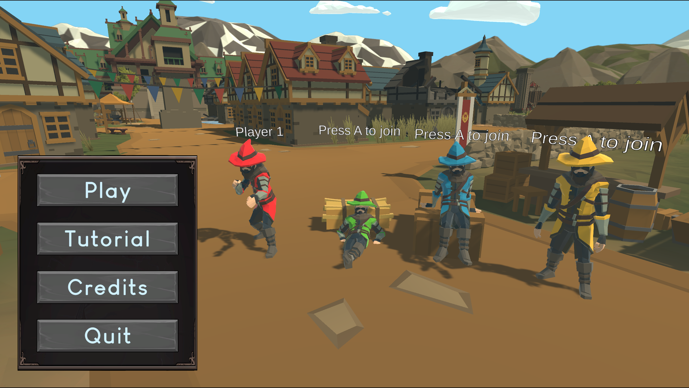
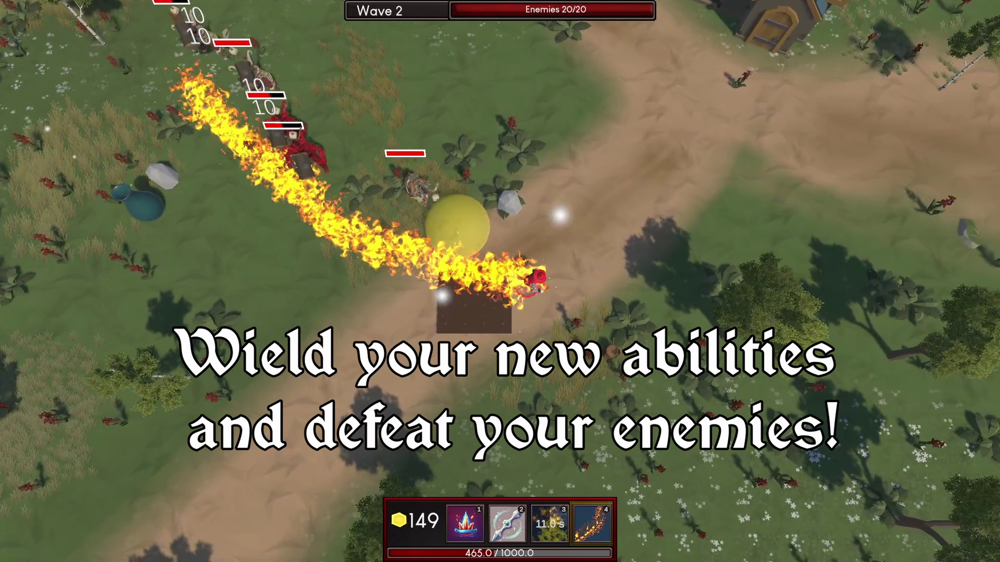
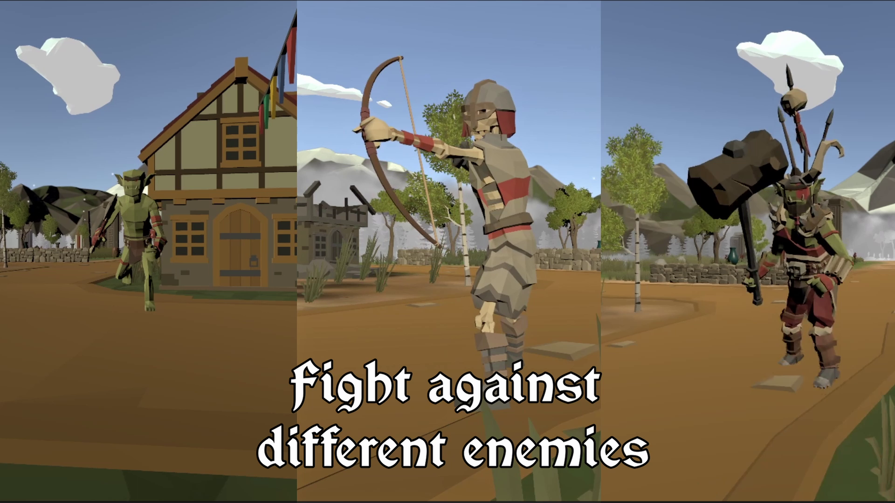
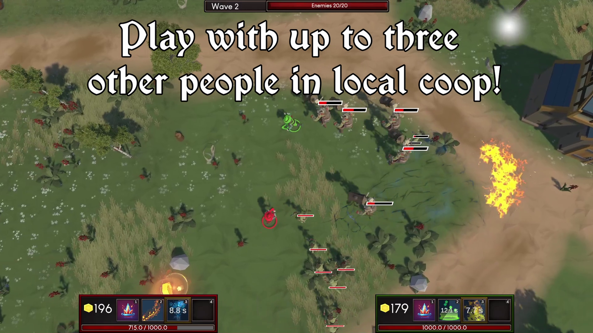

# Magic Mayhem

A cooperative wave survival game created by 4 students as a school project using Unity.

---
[Watch the gameplay trailer](https://www.youtube.com/watch?v=onranZEXbCc)

## Start Scene

The game launches into the `Menu` scene. From there, players can start the game, view credits, or enter the tutorial. Upon hitting 'Start', the game transitions to the `Level Design` scene.

---

## Controls

### Gameplay
| Action                    | Keyboard / Mouse | Controller   |
|--------------------------|------------------|--------------|
| Move                     | W / A / S / D     | Left Stick   |
| Aim                      | Mouse             | Right Stick  |
| Dodge                    | Ctrl              | B Button     |
| Open Shop (between waves)| E                 | X Button     |
| Interact / Trap / NPC    | F                 | A Button     |

### UI / Menus
| Action              | Keyboard / Mouse | Controller   |
|---------------------|------------------|--------------|
| Navigate Menu       | Mouse            | Left Stick   |
| Select Menu Item    | Click            | A Button     |
| Close Shop          | E                | X Button     |
| Swap Shop Tabs      | Tab              | Y Button     |

---

## How to Play

- Start at the splash screen → main menu.
- Options: **Play**, **Tutorial**, **Credits**, **Quit**.
- Tutorial teaches controls and lets players try spells.
- Survive **10 waves** of enemies.
- Between waves, use gold to buy or upgrade spells in the shop.
- Use traps and breakables to your advantage.
- Win by surviving all 10 waves.

---

## Features

### AI
- **Goblins**: Rush aggressively.
- **Warchiefs**: Leap at the player for massive damage.
- **Archers**: Maintain distance and shoot.
- **Golem**: Tanky and slow, but hard to kill.
- In Co-op, enemies target the nearest player.

### Character Control
- Smooth, root-motion-based movement.
- Hand/arm spellcasting animations.
- Fluid, reactive controls.

### Player Choice
- Use gold to buy or upgrade spells.
- Strategize based on spell cost, cooldown, and utility.
- Traps and pots can aid survival or generate extra gold.

### UI & Goals
- First-time launch leads to the tutorial.
- Subsequent launches go straight to gameplay.
- Waves and enemy counts shown at the top of the screen.
- Shop has button-based interaction with spell descriptions.
- End of game shows win/loss screen with restart/quit options.
- Pause menu allows quitting or returning to main menu.

### Interactive Environment
- Trigger traps (e.g. spike trap for 30 coins).
- Break pots and barrels to gain gold or health.
- Enemies respect world geometry (no clipping).

### Coop Survival
- Play with up to 3 additional players in local coop.
- Choose between either using a keyboard and mouse or controller.
- Each player has individual combat and shop UI.
- Game zooms out when players are far from each and zooms in when close.

---

## Known Issues

- NPC interaction during wave start may freeze time (rare).
- All enemies act independently — no team-based AI yet.
- Limited enemy variety — mostly offensive types.

---

## Team Contributions

### David
- Character Input & Animation
- Co-op Controls
- Enemy AI & Animation
- Level Loading & Scene Management
- Main Menu
- Magic Missile Spell
- Player Manager
- Tutorial Scene

### Moises
- Wave Spawning framework
- Ice Block, Meteor Strike, Ice Cone, Ice Blocks, Chain Lightning Spells
- All Hit/Death Sounds for Player & Enemies
- Health Potion + Sound
- Breakable Barrel + Sound
- Player Positional Indicator

### Noah
- Shop System
- Spell/Ability Framework
- Fireball, Shield, Napalm, Auras, Earth Shatter Spells
- HUD & UI Logic
- Credits Scene
- Loot System & Drops
- Tutorial NPCs & UI

### Joshua
- Level Design
- In-game Menus
- Spike Trap & Trigger Chests
- NPCs
- Physical Shop
- Gameplay Video & Trailer

---

## Third-Party Assets & Credits

### Models, Effects & VFX
- **Synty Studios** – Dungeon, Enemy, Hero, Environment Packs  
- **Mixamo** – Character animations, Paladin model  
- **Enkarra (Sketchfab)** – Stylized Wizard Hat  
- **Unity Asset Store**:
  - [Cartoon FX Free Pack (fireball, coin)](https://assetstore.unity.com/packages/vfx/particles/cartoon-fx-free-pack-169179)
  - [Hyper Casual FX (aura, shield)](https://assetstore.unity.com/packages/vfx/particles/hyper-casual-fx-200333)
  - [AOE Magic Spells Vol.1 (meteor/icecone)](https://assetstore.unity.com/packages/vfx/particles/spells/aoe-magic-spells-vol-1-133012)
  - [Particle Pack (earth shatter)](https://assetstore.unity.com/packages/vfx/particles/particle-pack-127325)
  - [Fire VFX (explosions)](https://assetstore.unity.com/packages/vfx/particles/fire-explosions/free-fire-vfx-266227)
  - [Props: Potions, Coins, Crates](https://assetstore.unity.com/packages/3d/props/props-3d-221035)

### Sound Effects
- [Collect Coin](https://pixabay.com/sound-effects/collectcoin-6075/)
- [Trap Spike Activate](https://pixabay.com/sound-effects/steel-blade-slice-2-188214/)
- [Trap Prime Sound](https://pixabay.com/sound-effects/mechanical1-107614/)
- [Priest Healing Aura Loop](https://freesound.org/s/560254/)
- [Fireball Explosion](https://freesound.org/s/431174/)
- [Freeze Cast](https://freesound.org/people/JustInvoke/sounds/446144/)
- [Spell Cast A (Elemental)](https://freesound.org/people/RescopicSound/sounds/749795/)
- [Barrel Break](https://freesound.org/people/kevinkace/sounds/66772/)
- [Clay Pot Break](https://freesound.org/people/Kinoton/sounds/399080/)
- [Potion Pickup](https://freesound.org/people/IENBA/sounds/698768/)
- [Earth Shatter SFX 1](https://freesound.org/people/uagadugu/sounds/222521/)
- [Earth Shatter SFX 2](https://freesound.org/people/NeoSpica/sounds/512243/)
- [Shield Hit](https://freesound.org/people/CTCollab/sounds/223630/)
- [Hard Hit](https://freesound.org/people/crunchymaniac/sounds/678424/)
- [Player Death](https://freesound.org/people/SoundBiterSFX/sounds/731506/)
- [Goblin Hit](https://freesound.org/people/HydraSound/sounds/736274/)
- [Goblin Death](https://freesound.org/people/Fenodyrie/sounds/565928/)
- [Warchief Hit/Death](https://freesound.org/people/efectirijillo/sounds/241979/)
- [Golem Hit](https://freesound.org/people/lolamadeus/sounds/179365/)
- [Golem Death](https://freesound.org/people/Artninja/sounds/750822/)
- [Skeleton Hit](https://freesound.org/people/cribbler/sounds/381859/)
- [Skeleton Death](https://freesound.org/people/spookymodem/sounds/202091/)